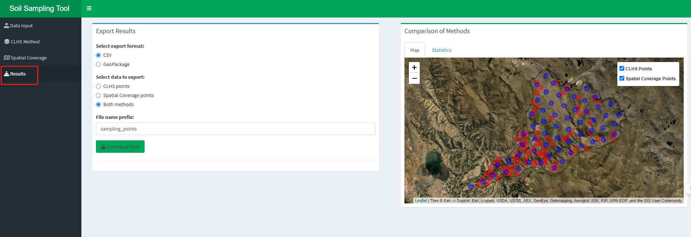

# Soil Sampling Design App



A Shiny application for designing optimized soil sampling schemes using two different methods:

1. **Conditioned Latin Hypercube Sampling (CLHS)**: Ensures that the selected points represent the full range of environmental variables while maintaining their correlation structure.
2. **Spatial Coverage Sampling**: Optimizes the spatial distribution of points by dividing the area into compact strata.

## Features

- Upload raster layers with automatic validation of file extensions and projection
- Define area of interest (AOI) using raster extent or uploaded boundary
- Configure and run two complementary sampling methods:
  - **CLHS**: Statistical representation of multivariate distributions
  - **Spatial Coverage**: Optimal spatial distribution of points
- Interactive visualization with both raster maps and leaflet-based interactive maps
- Accessibility analysis based on cost surfaces
- Tabular data display with sortable and filterable tables
- Statistical comparison between methods
- Export capabilities (CSV, GeoPackage)
- Progress indicators for long-running processes

## Setup and Dependencies

### Required R Packages

```R
install.packages(c("shiny", "shinydashboard", "terra", "sf", "raster", 
                 "clhs", "spcosa", "sp", "rJava", "tidyverse", "tmap", 
                 "DT", "shinyWidgets", "leaflet"))
```

### Java Requirement

The `spcosa` package requires Java. Make sure you have Java installed and properly configured:

1. Install Java Runtime Environment (JRE)
2. Set JAVA_HOME environment variable
3. Confirm R can find Java with `R CMD javareconf`

### Data Requirements

The app works with:

- **Input Rasters**: GeoTIFF raster files (.tif) containing environmental variables

  - All rasters must have the same spatial extent, resolution, and projection
  - Common variables include elevation, slope, aspect, soil properties, climate data, etc.
- **Area of Interest**:

  - Use the extent of input rasters or
  - Upload a boundary file (.gpkg, .geojson) to define the sampling area
- **Prior Sample Points** (optional):

  - For infill sampling mode, existing sample points (.gpkg, .shp) can be incorporated

## How to Run

1. Clone or download this repository
2. Open R or RStudio
3. Set working directory to the project folder
4. Run the app:

```R
shiny::runApp()
```

## Usage Guide

### 1. Data Input Tab

- **Input Configuration**:

  - Upload GeoTIFF raster files containing environmental variables
  - Define area of interest (AOI) using raster extent or by uploading a boundary file
- **Data Validation**:

  - Click "Check Data" to validate that inputs meet requirements
  - Review the data summary and extension check information
  - Troubleshoot any projection mismatches or other issues before proceeding

### 2. CLHS Method Tab

- **Parameters**:

  - Set the number of sample points to generate
  - Adjust the number of iterations for optimization (more iterations = better optimization but slower processing)
  - Configure cost surface options for accessibility constraints
- **Results**:

  - Examine points on the raster map with color-coding for accessibility
  - Review attribute data in the tabular view
  - Analyze the distribution of environmental variables at sampling locations

### 3. Spatial Coverage Tab

- **Parameters**:

  - Set the number of strata (typically close to desired sample size)
  - Configure optimization settings (tries, grid cells)
  - Choose sampling method:
    - **Centroid**: One point at the center of each stratum
    - **Random**: Random points within each stratum
    - **Infill**: Incorporating existing sample points
- **Results**:

  - Interactive map showing sampling points and study area
  - Tabular data with coordinates and attributes
  - Visual representation of the spatial stratification

### 4. Results Tab

- **Comparison**:

  - Interactive map showing points from both methods for visual comparison
  - Statistical plots comparing the distribution of environmental variables
- **Export**:

  - Select format (CSV or GeoPackage)
  - Choose which method's results to export
  - Download data for further analysis or fieldwork planning

## Advanced Features

### Cost Surface Analysis

The app can incorporate a cost surface to prioritize more accessible locations:

- Select any input raster as a cost layer
- Define a threshold for accessibility classification
- View color-coded results indicating more/less accessible points

### Infill Sampling

When additional samples are needed to complement existing data:

1. Select "Infill" as the sampling method in the Spatial Coverage tab
2. Upload or select existing sample points
3. The algorithm will generate new points optimized to fill gaps in spatial coverage

## Folder Structure

- `app.R`: Main application file containing both UI and server logic
- `data/`: Directory for input data files (optional, for local files)
- `outputs/`: Directory for exported results (created automatically)

## Troubleshooting

- **Memory Issues**: Large raster files may cause memory problems. Consider reducing resolution or extent.
- **Java Errors**: Ensure Java is properly installed and configured if experiencing issues with the spatial coverage method.
- **Projection Mismatches**: All input data should use the same coordinate reference system.

## References

- **CLHS**: Minasny, B. & McBratney, A.B. (2006). A conditioned Latin hypercube method for sampling in the presence of ancillary information. Computers & Geosciences, 32(9), 1378-1388.
- **Spatial Coverage**: Walvoort, D.J.J., Brus, D.J., & de Gruijter, J.J. (2010). An R package for spatial coverage sampling and random sampling from compact geographical strata by k-means. Computers & Geosciences, 36(10), 1261-1267.

## License

This project is licensed under the MIT License - see the LICENSE file for details.
